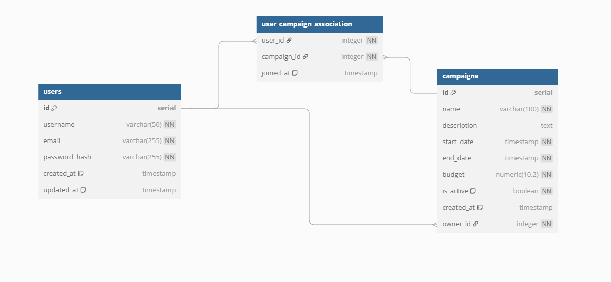

# Logical Data Model (LDM)

## 1. `users` Table

| **Column**      | **Type**            | **Constraints**                | **Description**                              |
|-----------------|---------------------|---------------------------------|----------------------------------------------|
| `id`            | `SERIAL`            | `PRIMARY KEY`                   | Unique identifier for the user.              |
| `username`      | `VARCHAR(50)`        | `UNIQUE, NOT NULL`              | Unique and non-null username for the user.   |
| `email`         | `VARCHAR(255)`       | `UNIQUE, NOT NULL`              | Unique and non-null email address for the user. |
| `password_hash` | `VARCHAR(255)`       | `NOT NULL`                      | The hashed password of the user.             |
| `created_at`    | `TIMESTAMP`          | `DEFAULT NOW()`                 | The creation date and time of the user.      |
| `updated_at`    | `TIMESTAMP`          | `DEFAULT NOW() ON UPDATE NOW()` | The last update date and time of the user.   |

## 2. `campaigns` Table

| **Column**      | **Type**            | **Constraints**                | **Description**                              |
|-----------------|---------------------|---------------------------------|----------------------------------------------|
| `id`            | `SERIAL`            | `PRIMARY KEY`                   | Unique identifier for the campaign.          |
| `name`          | `VARCHAR(100)`      | `NOT NULL`                      | The name of the campaign.                    |
| `description`   | `TEXT`              | `NULLABLE`                      | Description of the campaign.                 |
| `start_date`    | `TIMESTAMP`         | `NOT NULL`                      | The start date of the campaign.              |
| `end_date`      | `TIMESTAMP`         | `NOT NULL`                      | The end date of the campaign.                |
| `budget`        | `NUMERIC(10, 2)`    | `NOT NULL`                      | The budget for the campaign.                 |
| `is_active`     | `BOOLEAN`           | `NOT NULL DEFAULT TRUE`         | The status of the campaign (active or inactive). |
| `created_at`    | `TIMESTAMP`         | `DEFAULT NOW()`                 | The creation date and time of the campaign.  |
| `owner_id`      | `INTEGER`           | `NOT NULL REFERENCES users(id) ON DELETE CASCADE` | The user ID of the campaign owner.            |

## 3. `user_campaign_association` Table

| **Column**      | **Type**            | **Constraints**                | **Description**                              |
|-----------------|---------------------|---------------------------------|----------------------------------------------|
| `user_id`       | `INTEGER`           | `NOT NULL REFERENCES users(id) ON DELETE CASCADE` | The ID of the user associated with the campaign. |
| `campaign_id`   | `INTEGER`           | `NOT NULL REFERENCES campaigns(id) ON DELETE CASCADE` | The ID of the campaign associated with the user. |
| `joined_at`     | `TIMESTAMP`         | `DEFAULT NOW()`                 | The date and time when the user joined the campaign. |
| **PRIMARY KEY** | **(user_id, campaign_id)** | **PRIMARY KEY**                | The combination of both keys serves as the primary key. |

---


## SQL Representation:

```sql
-- users Table 
CREATE TABLE users (
    id SERIAL PRIMARY KEY,
    username VARCHAR(50) UNIQUE NOT NULL,
    email VARCHAR(255) UNIQUE NOT NULL,
    password_hash VARCHAR(255) NOT NULL,
    created_at TIMESTAMP DEFAULT NOW(),
    updated_at TIMESTAMP DEFAULT NOW() ON UPDATE NOW()
);

-- campaigns Table 
CREATE TABLE campaigns (
    id SERIAL PRIMARY KEY,
    name VARCHAR(100) NOT NULL,
    description TEXT,
    start_date TIMESTAMP NOT NULL,
    end_date TIMESTAMP NOT NULL,
    budget NUMERIC(10, 2) NOT NULL,
    is_active BOOLEAN NOT NULL DEFAULT TRUE,
    created_at TIMESTAMP DEFAULT NOW(),
    owner_id INTEGER NOT NULL REFERENCES users(id) ON DELETE CASCADE
);

-- user_campaign_association Table 
CREATE TABLE user_campaign_association (
    user_id INTEGER NOT NULL REFERENCES users(id) ON DELETE CASCADE,
    campaign_id INTEGER NOT NULL REFERENCES campaigns(id) ON DELETE CASCADE,
    joined_at TIMESTAMP DEFAULT NOW(),
    PRIMARY KEY (user_id, campaign_id)
);
```

# Merise Conceptual Data Model (MCD)
